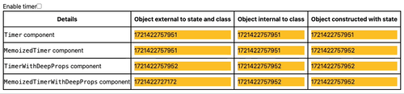

# react-memo-usage

Test package to explore component render behavior when using `memo` from `react`.

## Findings

The `compare` function for `memo` does not perform deep equality checks. When objects managed outside of state are used as props, `memo` will not perform a deep equals and thus not trigger a re-render of the memoized component.

## Demo

